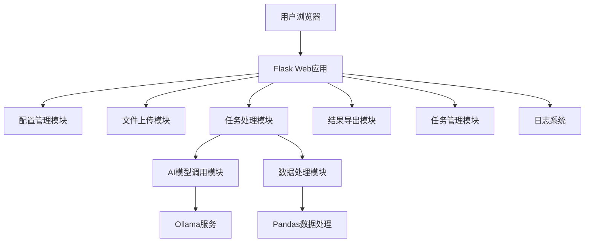

# 安全告警路径提取系统

这是一个基于AI模型的安全告警路径提取系统，可以从安全告警数据中自动提取可疑程序路径。

[](https://www.python.org/downloads/)
[](https://pypi.org/project/Flask/2.3.2/)
[](LICENSE)

## 🌟 项目概述

安全告警路径提取系统是一个智能化的数据处理平台，旨在自动化处理来自各种安全设备（如EDR、防火墙、IPS等）产生的告警数据。该系统利用先进的AI模型，从复杂的告警信息中精准提取出可疑程序的文件路径，帮助安全分析师快速定位潜在威胁。

系统采用模块化设计，具有良好的可扩展性和易用性，支持大规模数据处理，并提供了完整的Web界面进行操作和监控。

## ✨ 主要功能

- **配置管理**：可视化配置Ollama服务器地址、模型名称、处理参数等
- **文件上传**：支持Excel格式的安全告警数据文件上传
- **智能处理**：基于AI模型自动提取告警中的程序路径
- **任务管理**：异步处理大量数据，支持任务状态监控和管理
- **结果导出**：分类导出有效路径和无效记录，便于后续分析
- **日志追踪**：完整的处理日志，便于审计和问题排查

## 🏗️ 技术架构

### 后端技术栈
- **核心框架**：Python Flask 2.3.2
- **AI模型**：Ollama + Qwen大语言模型
- **数据处理**：Pandas 1.5.3
- **Excel处理**：openpyxl 3.1.2, xlrd 2.0.1
- **配置管理**：PyYAML 6.0.1
- **HTTP客户端**：httpx 0.24.1

### 前端技术栈
- **UI框架**：Bootstrap 5
- **模板引擎**：Jinja2
- **异步处理**：JavaScript原生支持

### 系统架构图


## 🚀 安装部署

### 环境要求

- Python 3.8+
- Ollama服务（需要运行并可访问）
- 支持的操作系统：Windows、macOS、Linux

### 安装步骤

1. **克隆项目代码**：
   ```bash
   git clone <repository-url>
   cd process_white_alarm
   ```

2. **安装依赖**：
   ```bash
   pip install -r requirements.txt
   ```

3. **启动Ollama服务**：
   确保Ollama服务正在运行，可以通过以下命令启动：
   ```bash
   ollama serve
   ```

4. **启动Web服务**：
   ```bash
   python web_app.py
   ```

5. **访问Web界面**：
   打开浏览器访问 http://127.0.0.1:5000

## 📖 使用指南

### 1. 系统配置
访问"配置管理"页面，设置以下关键参数：
- **Ollama服务器地址**：默认为 http://localhost:11434/api/generate
- **模型名称**：使用的AI模型名称
- **处理参数**：最大并发数、最大处理行数等

### 2. 文件上传
准备Excel格式的安全告警数据文件，确保包含必要的告警字段，然后在"文件上传"页面上传文件。

### 3. 列选择与过滤
上传文件后，系统会引导您选择需要处理的列，并可指定需要忽略的字段，提高处理准确性。

### 4. 任务处理
在任务详情页面点击"开始处理"按钮，系统将在后台异步处理任务。您可以随时查看处理进度。

### 5. 结果查看与导出
任务完成后，您可以：
- 下载有效结果（包含提取到的程序路径）
- 下载无效记录（无法处理或格式错误的数据）
- 查看详细处理日志

## 📁 项目结构

```
process_white_alarm/
├── config.yaml              # 系统配置文件
├── web_app.py               # Web应用主程序
├── white_alarm_processor.py  # 核心处理逻辑
├── config.py                # 配置管理模块
├── ollama_client.py         # Ollama客户端
├── requirements.txt         # Python依赖列表
├── tasks.json               # 任务数据存储文件
├── templates/               # HTML模板文件
│   ├── base.html            # 基础模板
│   ├── index.html           # 首页
│   ├── upload.html          # 文件上传页面
│   ├── config.html          # 配置管理页面
│   ├── task_list.html       # 任务列表页面
│   ├── task_detail.html     # 任务详情页面
│   ├── column_selection.html# 列选择页面
│   └── preview.html         # 数据预览页面
├── static/                  # 静态资源文件
│   ├── css/
│   │   └── style.css        # 自定义样式
│   └── js/
│       └── script.js        # JavaScript脚本
├── uploads/                 # 上传文件存储目录
├── results/                 # 处理结果存储目录
├── logs/                    # 日志文件存储目录
└── README.md                # 项目说明文档
```

## ⚙️ 核心处理逻辑

### 数据处理流程
1. 用户上传Excel文件并选择处理列
2. 系统逐行读取数据，根据用户选择构建输入文本
3. 调用Ollama AI模型提取程序路径
4. 对模型输出进行清洗和验证
5. 分类存储有效结果和无效记录

### AI模型交互
系统使用专门设计的提示词引导AI模型从安全告警中提取程序路径，确保输出格式统一且准确。

### 日志系统
采用双通道日志系统：
- **文件日志**：详细记录任务处理过程，便于问题排查
- **控制台日志**：仅显示Web服务基础信息，保持终端清洁

## 🔧 配置说明

系统主要配置项位于 `config.yaml` 文件中：

```yaml
# Ollama相关配置
ollama:
  url: http://localhost:11434/api/generate                # Ollama API地址
  model_name: alibayram/Qwen3-30B-A3B-Instruct-2507:latest  # 模型名称 可通过 ollama list查看模型名称
  timeout_seconds: 300                                    # 请求超时时间（秒）
  max_retries: 2                                          # 最大重试次数
  num_predict: 1000                                       # 模型单次生成最大 token 数
  format: json                                            # 响应格式（json/text）

# 处理相关配置
processing:
  max_workers: 10                                         # 最大并发处理线程数
  max_rows_to_process: null                               # 最大处理行数，null 表示无限制

# 日志相关配置
logging:
  format: text                                            # 日志格式（text/json）
  level: DEBUG                                            # 日志级别（DEBUG/INFO/WARNING/ERROR）
  log_dir: logs                                           # 日志文件存储目录
  log_file: '{log_dir}/{task_id}_{timestamp}.log'         # 日志文件名模板，支持 task_id 和 timestamp 占位符

# 输出与 Web 上传配置
output_dir: results                                       # 处理结果输出目录

web:
  upload_folder: uploads                                # 文件上传临时目录
  allowed_extensions:                                   # 允许上传的文件扩展名
    - xlsx
    - xls

# 系统提示词（AI模型指令）
system_prompt: |
  【严格模式】你是一个安全告警路径提取器，必须遵守：
  1. 输入是一段安全告警描述文本...
  ...
```

## 🛡️ 安全特性

- **路径验证**：严格的路径合法性检查，防止恶意输入
- **日志隔离**：任务日志与系统日志分离，防止信息泄露
- **文件访问控制**：严格的文件访问权限控制，防止路径遍历攻击
- **输入清洗**：对所有用户输入进行清洗和验证

## 📊 性能优化

- **异步处理**：采用多线程技术提高处理效率
- **内存管理**：优化数据处理流程，降低内存占用
- **日志轮转**：使用RotatingFileHandler防止日志文件过大
- **连接复用**：HTTP连接池复用，减少网络开销

### 开发规范
- 遵循PEP8代码风格
- 编写清晰的提交信息
- 添加必要的测试用例
- 更新相关文档

## 📃 许可证

本项目采用MIT许可证，详情请参阅 [LICENSE](LICENSE) 文件。

## 🆘 故障排除

### 常见问题

**Q: Ollama服务连接失败**
A: 确保Ollama服务正在运行，并检查配置文件中的URL是否正确。

**Q: 处理速度慢**
A: 可以调整`max_workers`参数提高并发数，但要注意系统资源限制。

**Q: 模型输出格式不正确**
A: 检查`system_prompt`配置，确保提示词能正确引导模型输出。

### 日志查看
系统日志分为两类：
- Web服务日志：直接在终端查看
- 任务处理日志：在`logs/`目录下查看对应任务的日志文件

